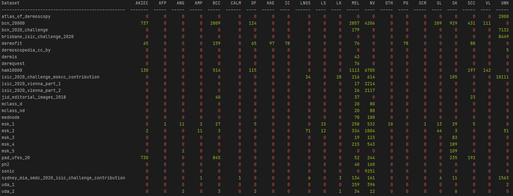

# SLA-CLI

[](https://gitHub.com/DavidWalshe93/SLA-CLI/graphs/commit-activity)
[](https://travis-ci.com/DavidWalshe93/SLA-CLI)
[](https://coveralls.io/github/DavidWalshe93/SLA-CLI)
[](https://app.codacy.com/gh/DavidWalshe93/SLA-CLI?utm_source=github.com&utm_medium=referral&utm_content=DavidWalshe93/SLA-CLI&utm_campaign=Badge_Grade_Settings)
[](https://opensource.org/licenses/MIT)
[](https://pypi.python.org/pypi/sla-cli/)
[](https://pypi.python.org/pypi/sla-cli/)
[](https://pepy.tech/project/sla-cli)


> A Skin Lesion Acquisition (SLA) CLI tool designed to help source data for skin lesion research.

## Introduction

While working on an academic project in the domain of automatic skin lesion detection it became clear that there was no
easy way to track down datasets cited highly in the literature

This is what motivated the creation of **SDA-CLI**.

**SDA-CLI** is targeted toward academic and medical researchers looking to source lesion dataset quickly to accelerate
their research efforts.

## Features at a Glance

**Available**

- Dataset summaries and label distribution.
- Console-based dashboards.

**WIP**

- Matplotlib integration for data distribution visualisation.
- Dataset downloading (public datasets only).
- Metadata extraction on applicable datasets.
- Data background information sources and links.
- Preprocessing of datasets for *binary classification*.

## Commands

The following sub sections discuss the how to use the tool.

The following conventions are used to describe tool usage.

```
<NAME>                ---> Required argument.

[NAME: DEFAULT_VALUE]  ---> Optional argument showing default value. 
```

If unsure of how to use a command, use **-h/--help** on any command to get context on what commands are available and
what they do.

### ls

The **ls** command is to gain quick insight into what data is available.

```shell
sla-cli ls [regex: '.*']              # Shows a list of dataset names available.
sla-cli ls -v totals [regex: '.*']    # Shows a list of dataset names and the number of images it contains.
sla-cli ls -v all [regex: '.*']       # Shows a list of dataset names and a full breakdown of all image label distribution
```

A sample of the **sla-cli ls -v all** output is shown below:


*Sample output of 'sla-cli ls -v all' command.*

